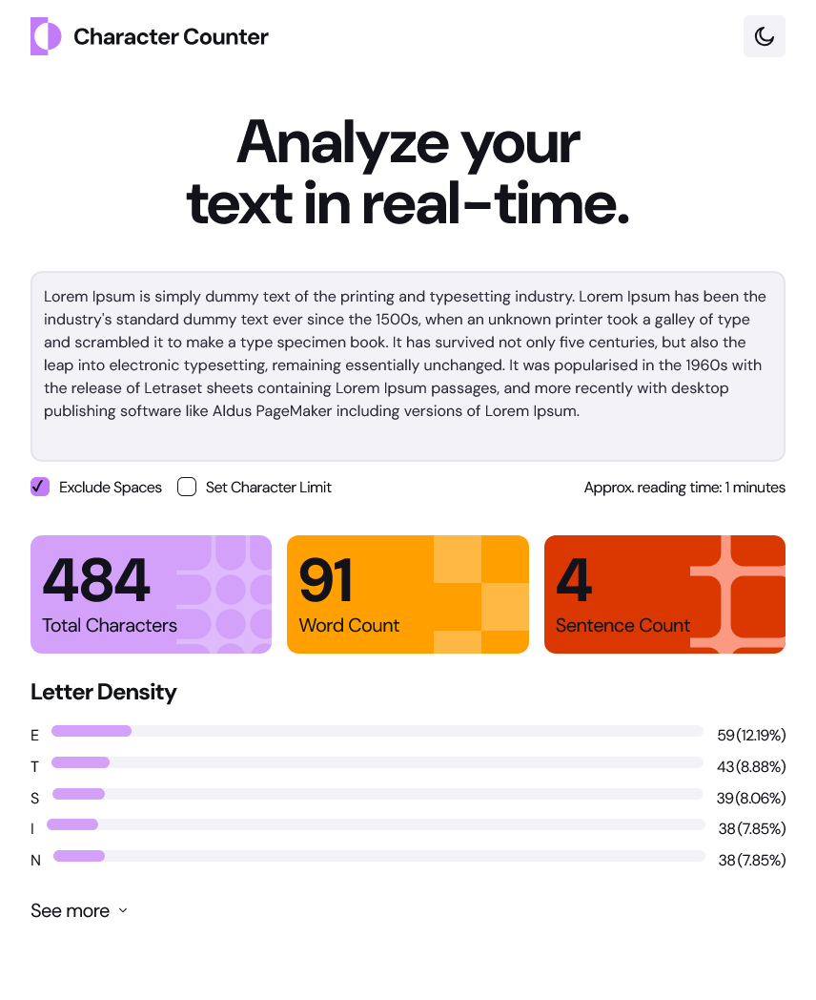
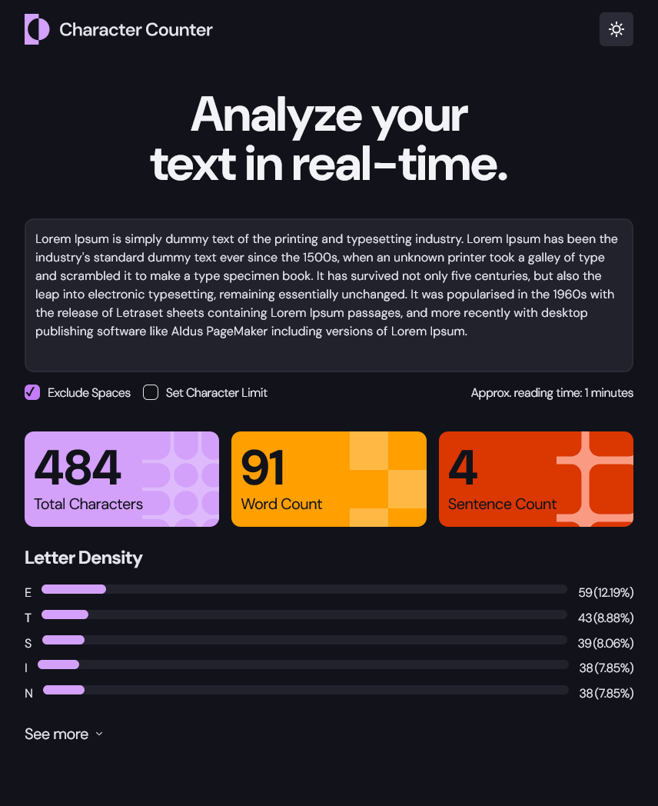
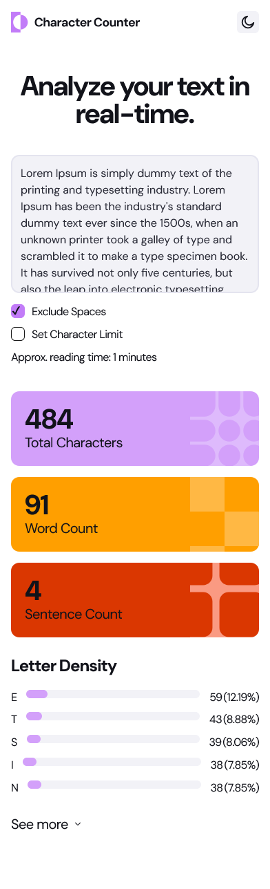

# Frontend Mentor - Character counter solution

This is a solution to the [Character counter challenge on Frontend Mentor](https://www.frontendmentor.io/challenges/character-counter-znSgeWs_i6). Frontend Mentor challenges help you improve your coding skills by building realistic projects.

## Table of contents

- [Overview](#overview)
  - [The challenge](#the-challenge)
  - [Screenshot](#screenshot)
  - [Links](#links)
- [My process](#my-process)
  - [Built with](#built-with)
  - [What I learned](#what-i-learned)
  - [Continued development](#continued-development)
  - [Useful resources](#useful-resources)
- [Author](#author)
- [Acknowledgments](#acknowledgments)

**Note: Delete this note and update the table of contents based on what sections you keep.**

## Overview

### The challenge

Users should be able to:

- Analyze the character, word, and sentence counts for their text
- Exclude/Include spaces in their character count
- Set a character limit
- Receive a warning message if their text exceeds their character limit
- See the approximate reading time of their text
- Analyze the letter density of their text
- Select their color theme
- View the optimal layout for the interface depending on their device's screen size
- See hover and focus states for all interactive elements on the page

### Screenshot





### Links

- Solution URL: [github](https://github.com/oloude)
  -Live site url : [Character counter](https://character-counter-site.netlify.app/)

## My process

### Built with

- Semantic HTML5 markup
- Flexbox
- CSS Grid
- Mobile-first workflow
- [React](https://reactjs.org/) - JS library
- [Typescript](https://www.typescriptlang.org/) - extends JavaScript

### What I learned

Use this section to recap over some of your major learnings while working through this project. Writing these out and providing code samples of areas you want to highlight is a great way to reinforce your own knowledge.

To see how you can add code snippets, see below:

```js
const [dark, setDark] = useState(false);

useEffect(() => {
  document.documentElement.setAttribute("data-theme", dark ? "dark" : "light");
}, [dark]);

function handleDarkToggle() {
  setDark((prev) => !prev);
}

function returnLengthWithoutSpace(word: string) {
  return word.replace(/\s/g, "").length;
}

function densityCounter(word: string) {
  let wordJoin = word.replace(/\s+/g, "").toLowerCase(); // Remove spaces correctly
  let frequency: Record<string, number> = {}; // TypeScript-friendly object

  for (let letter of wordJoin) {
    frequency[letter] = (frequency[letter] || 0) + 1; // Fix: Correct frequency calculation
  }

  return Object.entries(frequency);
}

function getReadingTime(text: string, wordsPerMinute: number = 150) {
  if (!text.trim()) return 0; // If text is empty, return 0 minutes

  const wordCount = text.trim().split(/\s+/).length;
  return Math.ceil(wordCount / wordsPerMinute);
}
```

## Author

- Frontend Mentor - [@oloude](https://www.frontendmentor.io/profile/oloude)
- Twitter - [@AbosedeOloude](https://www.twitter.com/abosedeoloude)
